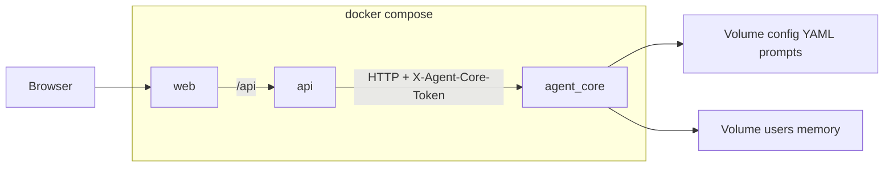

# Architecture: Agents Studio + agent_core

This document explains **how the system is structured**, **how data flows**, and **where to extend** behavior. Pair it with the root [README.md](../README.md) for install steps and [AGENTS.md](../AGENTS.md) for code pointers.

## System overview

Three cooperating processes, typically started with Docker Compose:

| Service (Compose name) | Role |
|------------------------|------|
| **web** | Next.js UI; proxies `/api` to the BFF. |
| **api** | NestJS BFF; JWT auth, Prisma/SQLite, SSE; holds `AGENT_CORE_TOKEN`. |
| **agent_core** | Python FastAPI orchestrator; routing, LLM calls, disk-backed memory. |

The browser **never** calls `agent_core` directly. The BFF calls it over HTTP on the internal Docker network (default base URL: `http://agent_core:8766`).

## Request path (conceptual)

1. User opens Studio in the browser → **`web`** serves UI.
2. UI calls **`/api/...`** → **`api`** validates JWT and performs the action.
3. For agent operations, **`api`** forwards to **`agent_core`** with **`X-Agent-Core-Token`**.
4. **`agent_core`** reads catalog from disk, routes the task, may call the LLM provider, reads/writes memory files under the data volume.

## Repository map (extension points)

| Goal | Start here |
|------|------------|
| Change env defaults | `apps/api/src/config/configuration.ts`, `.env.example` |
| Change HTTP client to core | `apps/api/src/modules/agents/agents.service.ts` |
| Change run/routing behavior | `apps/agent-core/main.py`, `apps/agent-core/router.py` |
| Change LLM provider / payload | `apps/agent-core/agents/runner.py` |
| Change memory paths / validation | `apps/agent-core/memory/manager.py` |
| Change catalog loading | `apps/agent-core/config.py` (`ASSISTANTS_YAML`, reload) |
| UI agent tree / API client | `apps/web/src/hooks/`, `apps/web/src/lib/` |
| Edit YAML/prompts from API | `apps/api/src/modules/config-editor/` |

## Layers inside agent_core

1. **Catalog** — `assistants.yaml` defines logical assistants (`me`, `wife` in the stock example) and their agents (keywords, model, `prompt_file`). Cached load; hot-reload via `POST /admin/reload-config`.
2. **Router** — Slash-commands, hints, keywords, optional LLM classification; may return `handled: false` for out-of-scope tasks.
3. **Runner** — Typically one chat completion per specialized run (provider wired in code; default DeepSeek).
4. **Disk memory** — Per assistant: `global.md`; per agent: `memory.md`, `working.md` under the data volume.
5. **HTTP API** — `run`, `agents`, session reset, memory append, metrics, admin reload (see README contract table).

## Volume layout (important for integrators)

- **Config** (shared by `api` and `agent_core`): `assistants.yaml`, `prompts/*.txt`. Mounted at **`/data/agent-core`** in Compose.  
  - `agent_core` uses **`ASSISTANTS_YAML`** and **`AGENT_CORE_CONFIG_ROOT`** so prompts edited from Studio resolve to the mounted tree (see `apps/agent-core/agents/runner.py`).
- **Data**: **`/data/agent-core-data`** in both containers.  
  - On disk: **`users/<assistant_id>/...`** (Studio BFF joins `users` under this root).  
  - **`agent_core`** sets **`AGENT_CORE_DATA_ROOT=/data/agent-core-data/users`** so its paths align with that layout.

## Network defaults

Compose defines an internal bridge network **`agents-studio`**. No external network is required for a standard clone-and-run flow.

### Advanced: existing Traefik or shared network

If you already run Traefik (or another proxy) on a shared external network:

1. Attach **`web`** (and optionally **`api`**) to that network for routing.
2. Keep **`agent_core`** without public ports and without a public router.
3. Ensure **`api`** and **`agent_core`** share a network where the hostname **`agent_core`** resolves.

## Optional: single-container deployment

Running uvicorn and Node in one image with a process supervisor is possible but **not** shipped here. The supported path is **three services** in one Compose file.

## Related docs

- [README.md](../README.md) — Install, env vars, troubleshooting  
- [OPENCLAW.md](OPENCLAW.md) — Another container calling `agent_core`  
- [AGENTS.md](../AGENTS.md) — Invariants and common UI failures  
